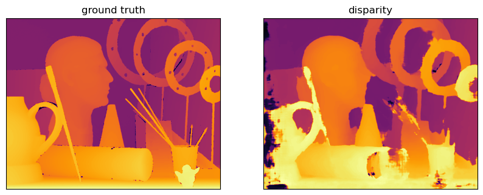
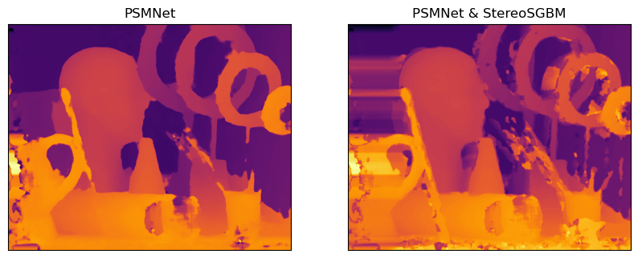

# CS4186 HW2: Stereo Disparity Estimation

Used finetuned neural network(PSMNet) and OpenCV library for disparity or depth estimation given two images from left and right cameras. The project aims to maximize PSNR scores between predicted and ground truth disparities(left camera image).

## Some Results


> Ground truth disparity map(left) vs disparity map predicted using SGBM from OpenCV(right).



> PSMNet output and PSMNet output combined with SGBM. Later discovered better method of normalizing output images, that improves results by clipping "peak" values and adding smoothing.

You can check out report and scores given in `results.txt`. [Report](CS4186_assignment2_report.pdf) shows experiments that we have tried.

Training PSMNet took ~18 hours on NVIDIA GTX970 and batch size of 1. SGBM parameters where manually chosen, by experimenting.

## How to run

Install required packages:

`pip install -r requirements.txt`

## Folder structure
```
root/
├── images/
│   ├── art/
│   │   ├── disp1.png
│   │   ├── view1.png
│   │   ├── view5.png
│   │   └── pred.png
│   └── ...
├── models/
│   └── finetune_248.tar
├── requirements.txt
├── postprocess.py
├── psmnet.py
├── sgbm.py
└── main.py
```
> Other directories or folders are not necessary to run program, but are to supplement report and submission.

Estimated disparity maps are saved in the corresponding directory with a name pred.png.  

## Available methods

Method `sgbm-psmnet` showed best results (you can refer to report).

* `sgbm` - run sgbm with inpainting and mean filtering.
* `psmnet` - run psmnet with inpainting and mean filtering.
* `sgbm-psmnet` - run method combining sgbm and psmnet results.

## Run disparity estimation

1. Modify some arguments in `main.py` if needed(not all systems support relative path):  
`args["imagedir"] = '/path/to/images'`  
`args["loadmodel"] = '/path/to/model'`  

2. Run on all images:  
`python main.py <method to run>`  

3. Output of `main.py` should look like:
```
images-art: 21.193373713365897
images-dolls: 22.700798084164965
images-reindeer: 21.072991080149762
Average PSNR score: 21.655720959226873
```
